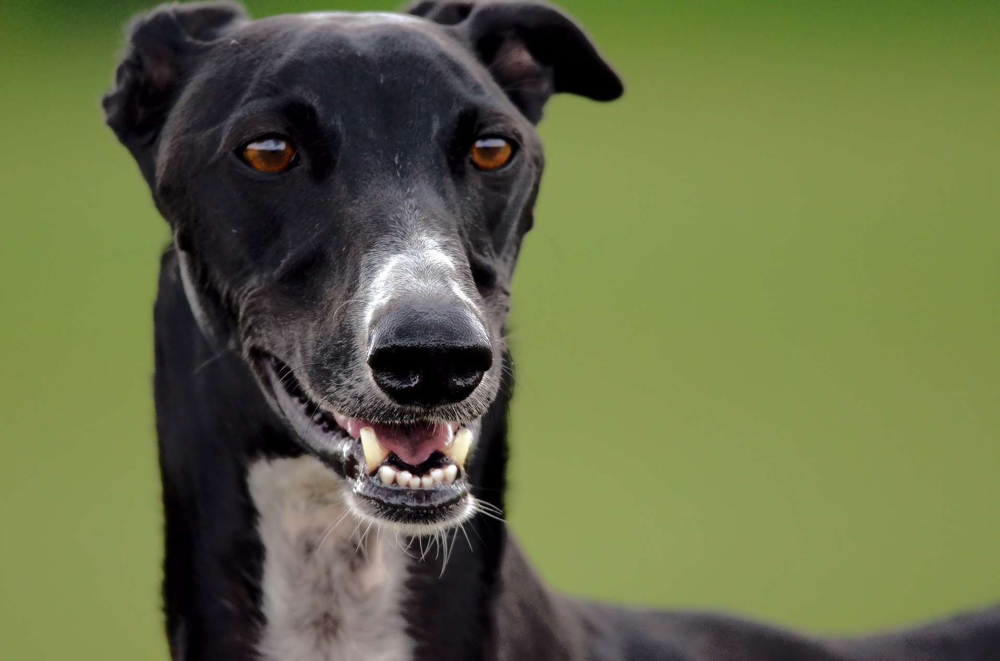
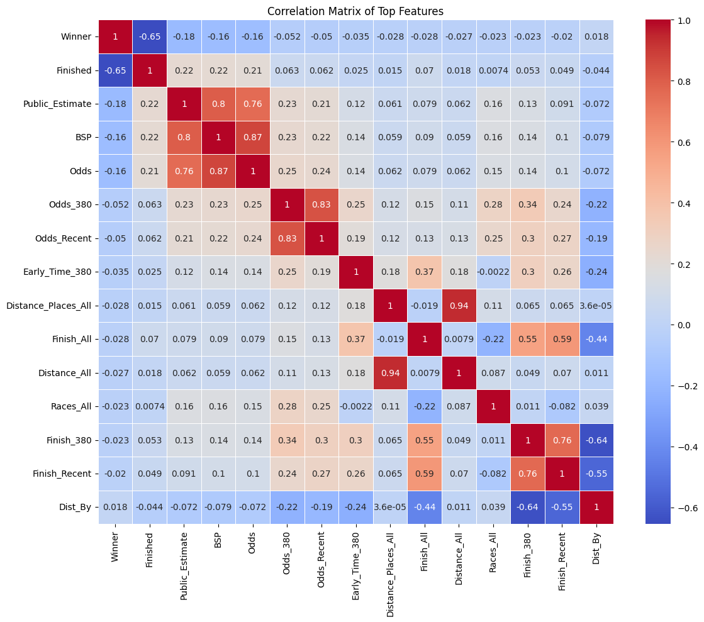

# Greyhound Racing

The purpose of this project is to use Machine Learning to predict greyhound finishers using a machine learning-based approach.

We can test whether a particular dog will win or not, or what place out of 6 it will finish in. The latter is, perhaps, the more interesting bet of the two, because typically the odds are smaller, meaning the payouts are higher if you get it right.

Predicting the target variable entails a typical classification problem. We will try the following tree-based models for this purpose, in order.
1. Logistic regression (predicting winner or not)
2. Decision tree (both for predicting "finished" and "winner".)
3. Boosted tree (both for predicting "finished" and "winner".)
4. Bagged tree (both for predicting "finished" and "winner".)
5. Random forest (both for predicting "finished" and "winner".)
6. AdaBoost (both for predicting "finished" and "winner".)
7. XGBoost (both for predicting "finished" and "winner".)

Here's a heatmap of all our predictors:

Model accuracy for predicting winners:

                 Model  Accuracy
0  Logistic Regression  0.834305
5             AdaBoost  0.834305
3    Gradient Boosting  0.833888
6              XGBoost  0.833056
2        Random Forest  0.832223
4   Bagging Classifier  0.829725
1        Decision Tree  0.734804

Model accuracy for predicting finishing position:

                Model  Accuracy
5             XGBoost  0.234804
2   Gradient Boosting  0.230225
4            AdaBoost  0.217735
3  Bagging Classifier  0.208160
1       Random Forest  0.207744
0       Decision Tree  0.182348

The full breakdown can be found in the notebook `greyhounds.ipynb`